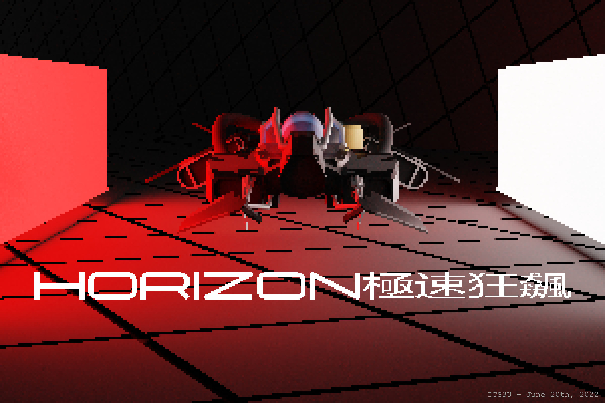

ICS3U ISU Game Assignment

Written in Java JDK 17

## Credits & Tribute

Thanks to the Blender Foundation for creating and maintaining Blender, the 3D design toolkit which were used to create all in-game visuals. 

Thanks to JetBrains for creating Intellj, the great Java IDE, which massively improved my programming efficiency. 

Thanks to Amplify Music for creating Launchpad, the tool used to create all in-game music.

Credits of the game concept and original art design goes to PikPok. I could only do my best to replicate your great designs!

## Known Bugs

There are currently four known bugs of the game, which are listed and explained below:
- Speeder react to directional key presses in pause menu: In the pause menu, if the user presses the left or right arrow keys, the speeder in game, though paused, will continue to react to the arrow keys accordingly but will be fixed in place. An unsatisfactory detail. 
- Flashy display in game: When the main game is running, the screen will continue to flash here-or-there randomly due to limitations in the components of the Java.Swing library and is a form of distraction for user. 
- Speeder-obstacle collision deregistration: *Extremely low chance of occurance (**once** in my three weeks of testing)*, the collision for one obstacle will deregister for a brief second, allowing the colliding speeder to be pushed to the left bound of the obstacle without crashing when clearly, the speeder should've crashed. 
- Phantom end-of-zone disappearance: This is a half-bug due to the game mechanism. At the end of a zone, the phantom, if travelling before the speeder, will disappear as it is teleported to the beginning of the map and later, followed by the speeder, during which time the phantom will reappear and to the user, it appears as if the phantom disappeared from the game for a brief second. 

## Additional Information

Fork this project on [GitHub](https://github.com/zerogtiger/horizon)! 

To disable crash by collision, comment out line 171 of the `Game` class, which writes: `gameOver(player.getDistance(), seed, 0);`
